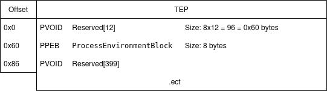

# MessageBox Shellcode

Writing shell-code in assembly at the begging may be a little complected (at lest for me), So you may Think you can write a shell-code in c then compile it. but it's not that easy. Writing a shell-code in c may require extra steps and some knowledge in windows internals and some other tricks.

In this write-up i ll show you how we can make windows MessageBox Shellcode in c.

First thing you should know about is TEB "Thread Environment Block".


> [!NOTE] Microsoft Docs
> The Thread Environment Block (TEB) structure describes the state of a thread.


```c
  typedef struct _TEB {
    PVOID Reserved1[12];
    PPEB ProcessEnvironmentBlock;
    PVOID Reserved2[399];
    BYTE Reserved3[1952];
    PVOID TlsSlots[64];
    BYTE Reserved4[8];
    PVOID Reserved5[26];
    PVOID ReservedForOle;
    PVOID Reserved6[4];
    PVOID TlsExpansionSlots;
  } TEB;
  
```


We are only interested in `ProcessEnvironmentBlock` field in this struct.

In x86_64 architecture windows holds the address of the `TEB` in spical register called `gs` (`fs` in legacy windows).

`PVOID` is just a 8 bytes pointer (in x64) so the size of the first field is 8x12 = 96 bytes.
So the pointer of the PEB is located 96 bytes away from the `PTEB` (`PTEB` + 96 = `PPEB`).
And the `gs` register is a pointer to the current `TEB`, so `PEB` pointer is gs + 96 (`PPEB` = gs + 96).




So based on that. We can get the address of PEB like that:
```asm
mov		rax, [gs + 0x60]
```

Gnu compilers have a micro can do the same in c called `__readgsqword`:
```c
PPEB pPEB = __readgsqword(0x60);
```

So now we know how to get the address of `PEB`, But Why ??
We need the `PEB` to get the address of `kernel32.dll` from the process memory which contains the function `LoadLibraryA` That we need it to load `user32.dll` which is not loaded by default like `kernel32.dll` and `ntdll.dll`.

```c
typedef struct _PEB {
  BYTE                          Reserved1[2];
  BYTE                          BeingDebugged;
  BYTE                          Reserved2[1];
  PVOID                         Reserved3[2];
  PPEB_LDR_DATA                 Ldr;
  PRTL_USER_PROCESS_PARAMETERS  ProcessParameters;
  PVOID                         Reserved4[3];
  PVOID                         AtlThunkSListPtr;
  PVOID                         Reserved5;
  ULONG                         Reserved6;
  PVOID                         Reserved7;
  ULONG                         Reserved8;
  ULONG                         AtlThunkSListPtr32;
  PVOID                         Reserved9[45];
  BYTE                          Reserved10[96];
  PPS_POST_PROCESS_INIT_ROUTINE PostProcessInitRoutine;
  BYTE                          Reserved11[128];
  PVOID                         Reserved12[1];
  ULONG                         SessionId;
} PEB, *PPEB;
```


